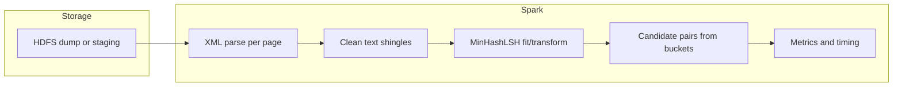

# Scalable Near-Duplicate Detection (Spark + MinHash LSH)

## Context

Your proposal targets **approximate** similarity at scale: **MinHash** estimates Jaccard similarity between document sets; **LSH** buckets similar hashes so you compare only candidates in the same bucket (sub-quadratic work). Apache Spark distributes parsing, feature construction, and LSH. **HDFS** stores the multi-GB bz2 dump and intermediate outputs so executors read data locally after replication.

The workspace repo is currently empty; implementation will be new Python/PySpark code plus run scripts and minimal config.

## Dataset: is one multistream shard enough?

**Yes, for a typical college project this file is sufficient.**

Your file `enwiki-20260301-pages-articles-multistream2.xml-p41243p151573.bz2` is a **multistream “pages-articles” shard**: it is real English Wikipedia article XML (same general structure as the proposal’s `enwiki-*-pages-articles*.xml.bz2`), but it covers **only one page-ID range** of the full dump—not every article on Wikipedia. Multistream exists so large dumps can be split into parallel-downloadable parts.

**Use this shard alone when:**

- The goal is to implement and evaluate **MinHash + LSH on Spark** with a **large, realistic** text corpus.
- You document clearly in the report: *“We use one multistream shard (date 20260301, page range …) as a representative subset; methods generalize to the full dump on HDFS.”*

**Consider adding more data only if:**

- The rubric or instructor requires the **full** `pages-articles` dump or a **minimum article count**.
- You need **stronger scalability graphs** (e.g. 10M+ articles); then add **more multistream shards** from the same [dumps.wikimedia.org](https://dumps.wikimedia.org) date (same schema) or run on the **full** multistream set plus index, per Wikimedia’s multistream instructions.
- Near-duplicate **evaluation** feels thin (few obvious duplicates in one slice); you can still satisfy the “accuracy trade-off” objective with **sampled exact Jaccard** vs LSH and/or **synthetic** near-duplicates for controlled recall/precision.

**Practical note:** Do not commit multi-GB `.bz2` files to Git; keep them on disk/HDFS and ignore them in `.gitignore`.

**Proposal wording:** The report can cite `enwiki-latest-pages-articles.xml.bz2` as the **family** of dumps used; your actual runs use a **multistream shard** of the same schema—state that explicitly so evaluators see consistency with section 6 of the proposal.

## Scalability: matching the proposal (“large-scale,” “distributed,” “increasing data volumes”)

Your proposal requires **scalability** in two senses: **algorithmic** (avoid naive O(n²) all-pairs similarity) and **systems** (Spark + HDFS for large corpora). The plan below satisfies both in the **report and experiments**, even if one course uses a single large shard rather than the entire English Wikipedia.

### Algorithmic scalability (what you argue in the literature / design chapter)

- **Naive pairwise comparison** over unique pairs scales as **O(n²)** in document count; it is infeasible at Wikipedia scale.
- **MinHash + LSH** targets **approximate** near-duplicate detection: hashing and banding produce **candidate pairs** whose count is **sub-quadratic** in typical settings (report should cite standard LSH analysis and your chosen `numHashTables` / `numHashFunctions`).
- **Optional controlled baseline:** On a **small random subset** of documents (e.g. thousands), run **exact** Jaccard (or all-pairs within the subset) and compare **runtime** to the LSH pipeline on the same subset—illustrates the **efficiency vs accuracy** objective without claiming O(n²) on millions of docs.

### System scalability (Spark + HDFS)

- **HDFS:** Store input (bz2 or, better for parallelism, **converted Parquet/JSON partitions** on `hdfs://`) so the cluster can read **in parallel**; mention **replication and block locality** in the architecture section (Nitin’s design write-up).
- **Spark:** Use **partitioned** DataFrames/RDDs, `repartition`/`coalesce` where appropriate, and **avoid** driver bottlenecks (`collect` on large results). Log **executor parallelism** (cores, partitions) in the report.
- **Parallel ingest:** After a **one-time conversion** of XML to many HDFS files/partitions, each stage (parse → features → LSH → join) runs as **distributed** transformations—this is the “distributed framework” your objectives describe.

### Empirical scalability (objective: “evaluate system performance under increasing data volumes”)

Run a **scaling study** that is easy to reproduce and honest:

1. **Increasing n:** Fix cluster/config; measure **end-to-end runtime** (and optionally stage times from Spark UI / event logs) for **multiple sample sizes** drawn from the same corpus—e.g. **10% / 25% / 50% / 100%** of articles in your shard, or **1 / 2 / 4** multistream shards if you add more files. Plot **time vs n** (and optionally **throughput** = articles per second).
2. **Strong scaling (optional):** For a **fixed** subset size, vary **parallelism** (e.g. `--num-executors` or partition count) and report runtime—shows the framework uses the cluster.
3. **Metrics to export:** Wall-clock, Spark **shuffle read/write**, number of **candidate pairs** (LSH output size), and **driver/executor memory** settings—enough for Nitin’s report figures.

This directly supports the proposal sentence on **“efficiently process large datasets in a distributed environment”** and the objective on **increasing data volumes**, without requiring you to process the entire multi-terabyte dump if that is out of scope for the lab.

## Architecture (high level)

## Recommended tech mapping

| Proposal item          | Practical choice                                                                                                                                                                                                                                                                                                   |
| ---------------------- | ------------------------------------------------------------------------------------------------------------------------------------------------------------------------------------------------------------------------------------------------------------------------------------------------------------------ |
| Apache Spark (PySpark) | **Spark 3.x** with **MLlib** [`MinHashLSH`](https://spark.apache.org/docs/latest/ml-features.html#minhash-for-jaccard-distance) (Jaccard / MinHash).                                                                                                                                                               |
| Hadoop HDFS            | Store the chosen dump shard(s), e.g. `enwiki-20260301-pages-articles-multistream2.xml-p41243p151573.bz2` (and optionally **Parquet** of `page_id, title, text` after one-time parse) on HDFS; Spark reads `hdfs://...` paths.                                                                                      |
| Wikipedia XML          | **One-time** or **streaming** parse: Spark’s `wholeTextFiles` is poor for one giant XML file; typical pattern is **`spark-xml`** package **or** a **preprocessing job** (e.g. `wikiextractor`, or a custom SAX/bz2 streamer) that writes **sharded JSON/Parquet** to HDFS, then Spark consumes shards in parallel. |

**Important constraint:** A single multi-GB `.xml.bz2` is awkward to parse in parallel from the middle of the file. For the course project, the usual approach is: (A) **pre-split or pre-convert** the dump to many files on HDFS, then Spark scales; or (B) accept a **subset** of articles for demos and still report scalability via **synthetic scaling** (duplicate subsets, repartitioning experiments). The report should state which option you used and why.

## Implementation steps

### 1. Environment and dependencies

- **PySpark** with a pinned Spark version; add `requirements.txt` (e.g. `pyspark`, `numpy`; optional `pytest` for unit tests).
- **HDFS**: If no cluster, use **pseudo-distributed** Hadoop in a VM/Docker, or your lab’s cluster; document the **namenode URI** and upload commands (`hdfs dfs -put`).
- **Spark submit**: `spark-submit --packages com.databricks:spark-xml_2.12:...` if using spark-xml (version must match Scala/Spark).

### 2. Data ingestion and article records

- **Source:** [Wikimedia dumps](https://dumps.wikimedia.org) — for this project, **one multistream shard** such as `enwiki-20260301-pages-articles-multistream2.xml-p41243p151573.bz2` (text-only XML inside bz2), or the full `pages-articles` / multistream set if you need more volume.
- **Target schema:** `id`, `title`, `text` (plain text), optionally `revision` if needed.
- **Parsing strategy (pick one for the team):**
  - **Option A (strong for “big data” story):** Run an external extractor to Parquet/JSON lines on HDFS, then Spark reads **partitioned** Parquet (fast, parallel).
  - **Option B:** Use **spark-xml** with a defined `rowTag` (e.g. `page`) if the dump structure matches; validate on a **small** extracted sample first.

Filter out non-article namespaces if required (Wikipedia XML includes redirects, etc.—your code should match dump structure from a sample).

### 3. Text to sets for Jaccard / MinHash

- Normalize text (lowercase, strip markup if any remains).
- Build **k-shingles** (character or word n-grams) or **hashed shingles** to cap vocabulary.
- Convert to **binary feature vectors** or use Spark’s pipeline: e.g. **`CountVectorizer`** with `binary=True` on token sequences, or custom UDF producing `SparseVector` / `Vector` as required by `MinHashLSH` input (see Spark docs: input is typically sparse **binary** feature vectors for Jaccard).

### 4. MinHash LSH pipeline

- **`MinHashLSH`**: set `numHashTables` and `numHashFunctions` (these drive **accuracy vs recall** and **number of candidates**).
- **`approxSimilarityJoin`** (or transform + join on bucket ids) to get **candidate pairs** above a **Jaccard distance** threshold (or similarity threshold depending on API).
- **Deduplicate** pairs `(min(id1,id2), max(id1,id2))` and persist results (e.g. Parquet/CSV of pairs + scores).

### 5. Evaluation (matches your objectives)

- **Scalability (required for proposal):** Structured experiments under **increasing data volume** (see **Scalability** section above): time vs n, Spark shuffle/stage metrics, optional parallelism sweep. Include **1–2 clear plots** and a short interpretation (near-linear vs superlinear behavior, bottlenecks).
- **Accuracy trade-off:** On a **stratified sample**, compare **LSH candidate pairs** to a **ground-truth** defined by exact Jaccard (or high-threshold exact similarity) on the same sample; report **precision/recall** (or FP rate) as **`numHashTables` / `numHashFunctions` / distance threshold** change. Tie explicitly to **computational efficiency** (candidate count, runtime).
- **Optional:** Tiny-subset **brute-force** baseline to contrast with LSH runtime on equal n.

### 6. Deliverables alignment

- **Program code:** Modular layout, e.g. `src/` with `ingest`, `features`, `lsh_pipeline`, `evaluate`; `scripts/` for `spark-submit`; `tests/` for unit tests (pure Python on small fixtures).
- **Report:** Nitin’s sections (architecture, literature) can cite **MinHash/LSH** and **Spark**; Basu documents repo layout and reproduction; Shashi owns tests and Git workflow (branches, tags for milestones).

### 7. Repository hygiene (Basu / Shashi)

- Root **`README.md`**: project title, team, what is in the repo, dataset notes (no large files in Git), requirements pointer, links to the usage guide and [Spark_LSH_Wikipedia_plan.md](Spark_LSH_Wikipedia_plan.md).
- **`HOW_TO_USE.md`** (or **`HOW_TO_USE.txt`**): step-by-step for anyone cloning from GitHub—clone, prerequisites, data download/HDFS, Spark configuration, how to run pipeline and tests when code exists, troubleshooting.
- `.gitignore`: exclude large dumps, Spark checkpoints, and `__pycache__`.

## Risks and mitigations

- **Single monolithic bz2:** Parallelism is limited until data is **split or converted** — plan explicitly for a **conversion stage** or **subset** for reliable cluster demos.
- **Memory:** Tune partition count; avoid `collect()` on large RDDs; use **sampling** for QA.
- **Spark XML quirks:** Validate against a **1000-page** snippet before full runs.

## Suggested team split (coding)

- **Shashi:** Core PySpark pipeline, `pytest` on small XML snippets and LSH on toy vectors.
- **Basu:** QA scripts (pair counts, sanity checks), README, CI-friendly smoke test if feasible.
- **Nitin:** Report diagrams and evaluation narrative fed by exported metrics (JSON/CSV from your evaluation module).

No code exists in the repo yet; after you approve this plan, implementation starts with **environment + small-sample XML**, then **LSH end-to-end**, then **scale + metrics**.
